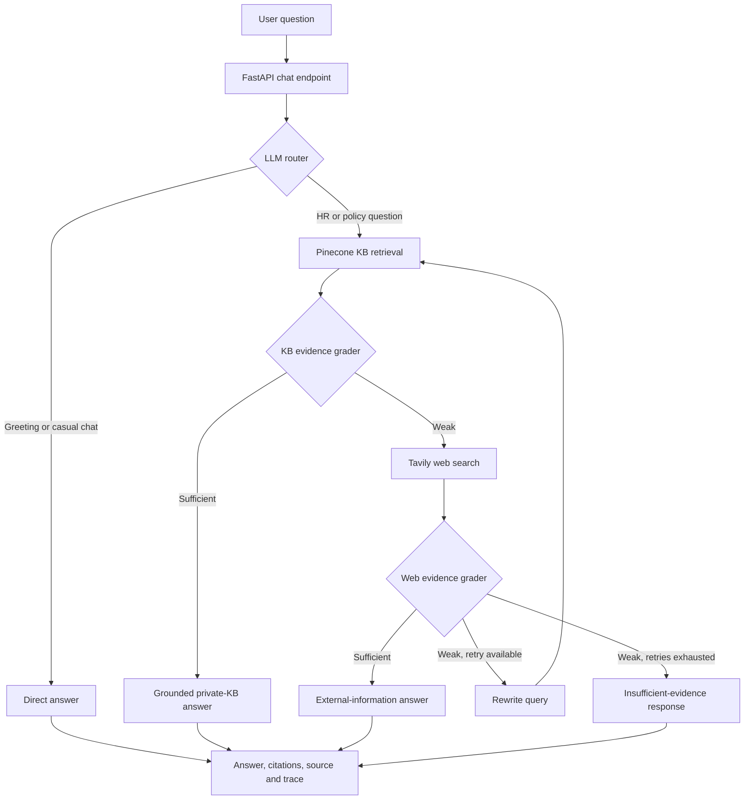

# Agentic RAG — HR Document QA

A production-oriented Retrieval-Augmented Generation system built with FastAPI,
LangGraph, LangChain, Pinecone, Gemini/Mistral generation, and Tavily web fallback.
Alongside the application, this repository includes a reproducible retrieval evaluation
harness used to select chunking and reranking configurations from measured outcomes.

<!-- RAG_EVAL_RESULTS_START -->
## Key findings

- Evaluated **18 retrieval configurations** across **3 chunking strategies** on **40 grounded questions** from **3 documents**.
- Best-ranked configuration: `recursive_512_0__rerank`, achieving **100.0% Hit@5**, **0.975 MRR@5**, and **95.6% evidence Recall@5**.
- Mean cross-encoder impact on identical first-stage candidates: **+7.2 percentage points Hit@3** and **+0.141 MRR@5**, at **+159.9 ms p95 latency**.

## Top five configurations

Ranked by MRR@5, then Evidence Recall@5, Hit@5, and p95 latency.

| Rank | Configuration | Chunks | Reranker | Hit@1 | Hit@3 | Hit@5 | Evidence Recall@5 | Full Recall@5 | MRR@5 | nDCG@5 | p95 latency |
|---:|---|---:|---|---:|---:|---:|---:|---:|---:|---:|---:|
| 1 | `recursive_512_0__rerank` | 80 | cross-encoder/ms-marco-MiniLM-L-6-v2 | 0.950 | 1.000 | 1.000 | 0.956 | 0.900 | 0.975 | 0.946 | 200.8 ms |
| 2 | `semantic_90__rerank` | 52 | cross-encoder/ms-marco-MiniLM-L-6-v2 | 0.950 | 1.000 | 1.000 | 0.944 | 0.875 | 0.975 | 0.940 | 310.6 ms |
| 3 | `fixed_512_100__rerank` | 81 | cross-encoder/ms-marco-MiniLM-L-6-v2 | 0.925 | 1.000 | 1.000 | 0.944 | 0.875 | 0.963 | 0.924 | 166.2 ms |
| 4 | `recursive_1024_200__rerank` | 43 | cross-encoder/ms-marco-MiniLM-L-6-v2 | 0.900 | 1.000 | 1.000 | 0.944 | 0.875 | 0.950 | 0.921 | 220.3 ms |
| 5 | `recursive_512_100__rerank` | 86 | cross-encoder/ms-marco-MiniLM-L-6-v2 | 0.900 | 1.000 | 1.000 | 0.931 | 0.850 | 0.946 | 0.905 | 137.6 ms |

[View the complete 18-configuration report](rag_eval/data/benchmark_report.md).
<!-- RAG_EVAL_RESULTS_END -->

## Why this is agentic RAG

A conventional RAG pipeline always retrieves context and immediately asks a model to
answer. This application instead uses a stateful decision graph: it chooses a route,
grades the available evidence, changes strategy when evidence is weak, and stops rather
than inventing an unsupported answer.



### Architecture components

| Component | Responsibility |
|---|---|
| FastAPI API | Validates chat and ingestion requests and returns answers, citations, source type, and trace |
| LangGraph workflow | Maintains state and controls routing, grading, fallback, retry, and termination |
| LLM router | Sends HR/policy questions to retrieval and simple conversation to a direct response |
| Pinecone retriever | Searches the private HR knowledge base using Gemini embeddings |
| Evidence graders | Decide whether private or web evidence is specific enough to answer safely |
| Tavily fallback | Retrieves public information only when private KB evidence is insufficient |
| Query rewriter | Reformulates weak searches once before the workflow stops |
| Grounded generators | Answer from the selected evidence source and expose provenance |
| Ingestion service | Loads PDF, Markdown, text, and Word files, chunks them, and indexes them |
| Audit store | Records questions, selected source, and workflow trace for operational review |

The runnable API starts in `run.py`; the workflow is in `app/rag/workflow.py`. Reference
diagrams are available in [architecture.png](architecture.png) and
[workflow.png](workflow.png).

## Evaluation methodology

The benchmark evaluates retrieval independently from answer generation. Its central
question is: **did the system retrieve every passage required to answer, and how highly
did it rank those passages?**

For each chunking configuration, the runner performs the following controlled process:

1. Verify that the versioned evaluation corpus matches the live two-Markdown-plus-PDF KB.
2. Validate every gold passage against its declared filename and PDF page.
3. Chunk all documents and assign stable source/page/chunk identifiers.
4. Embed the chunks and build a fresh, isolated Chroma collection.
5. Retrieve the top 20 candidates once for each of the 40 questions.
6. Score the original vector ordering as the no-reranker baseline.
7. Send the exact same cached candidates to the cross-encoder and retain its top 10.
8. Calculate retrieval quality, evidence coverage, failure, indexing, and latency metrics.
9. Remove the isolated index unless `--keep-index` is requested.
10. Save run metadata and per-query diagnostics, then generate this ranked report.

The shared candidate pool is the key isolation control: differences between paired runs
come from reranking rather than a second embedding call, network variance, or a changed
retrieval result. Query failures remain in the denominator as zero-result evaluations.

### Golden dataset

`rag_eval/data/eval_dataset.json` contains:

- 40 human-curated questions and reference answers
- 51 verbatim gold evidence passages
- 3 source documents: two Markdown files and the uploaded 18-page PDF
- 17 easy, 14 medium, and 9 hard questions
- 9 multi-evidence questions, including 5 that require multiple source documents
- Direct facts, constraints, procedures, classification, PDF-page retrieval,
  multi-hop synthesis, and policy-conflict detection

Every evidence label includes a unique ID, source filename, page, section, and exact
passage. A preflight validator rejects fabricated quotes, wrong pages, unknown sources,
duplicate IDs, stale snapshots, and incomplete labels.

### Chunking experiment matrix

Chunk sizes and overlaps are character counts. Nine chunking configurations are paired
with baseline and reranker arms, producing 18 measured retrieval configurations.

| Strategy | Chunk size | Overlap | Experimental purpose |
|---|---:|---:|---|
| Fixed | 256 | 0 | Small independent windows |
| Fixed | 256 | 64 | Small windows with 25% overlap |
| Fixed | 512 | 0 | Larger independent windows |
| Fixed | 512 | 100 | Larger windows with boundary protection |
| Recursive | 512 | 0 | Structure-aware splitting without overlap |
| Recursive | 512 | 100 | Structure-aware splitting with overlap |
| Recursive | 1024 | 0 | Large context windows |
| Recursive | 1024 | 200 | Large context windows with overlap |
| Semantic | Automatic | Automatic | Topic boundaries at the 90th-percentile semantic break |

Fixed splitting is the simple control and may cut through sentences. Recursive splitting
prefers headings, paragraphs, lines, sentences, and words before falling back to character
boundaries. Semantic splitting uses embedding similarity changes and a minimum chunk size
of 100 characters.

### Retrieval and reranking parameters

| Parameter | Measured run value | Meaning |
|---|---|---|
| Vector store | Chroma | Isolated local index for each chunk configuration |
| Embeddings | `sentence-transformers/all-MiniLM-L6-v2` | Local semantic vectors; document text stays on the machine |
| Candidate K | 20 | Number of first-stage vector results available to both arms |
| Output K | 10 | Number of final chunks retained for evaluation |
| Reranker | `cross-encoder/ms-marco-MiniLM-L-6-v2` | Jointly scores each query and candidate passage |
| Evidence threshold | 60% token coverage | Minimum gold-passage coverage after source/page matching |

The baseline keeps the original vector ranking. The reranker jointly reads the query and
each of the same 20 passages, reorders them, and returns its top 10. Model-load latency is
recorded separately from per-query inference latency.

### Metrics and ranking

- **Hit Rate@K:** fraction of questions with at least one gold passage in the top K.
- **Evidence Recall@K:** fraction of distinct required passages retrieved, macro-averaged
  across questions.
- **Full Recall@K:** fraction of questions for which every required passage was found.
- **MRR@K:** reciprocal rank of the first relevant passage, averaged across questions.
- **nDCG@K:** rank-sensitive gain with duplicate evidence matches suppressed.
- **Precision@K:** distinct relevant evidence divided by returned context count.
- **Latency:** average, p50, and p95 retrieval-plus-reranker time.

The published leaderboard ranks configurations by **MRR@5**, then
**Evidence Recall@5**, **Hit@5**, and finally **p95 latency**. This prioritizes placing
useful evidence early, then complete evidence coverage, overall retrieval success, and
latency as a tie-breaker. Overlapping chunks matching the same evidence ID receive credit
only once.

## Repository layout

```text
.
├── app/                         # API, ingestion, Pinecone retrieval, LangGraph workflow
├── data/sample_kb/              # Two Markdown knowledge-base documents
├── uploads/HR-Policy.pdf        # PDF currently in the KB
├── rag_eval/
│   ├── data/
│   │   ├── raw_documents/       # Versioned snapshot of evaluated documents
│   │   ├── eval_dataset.json    # Grounded question and evidence labels
│   │   └── benchmark_report.md  # Ranked results from the complete local run
│   ├── src/                     # Chunkers, vector index, reranker, metrics, pipeline
│   ├── tests/                   # Unit and corpus-grounding integration tests
│   ├── benchmark.py             # Experiment runner
│   ├── generate_report.py       # Markdown and README publisher
│   └── prepare_data.py          # Corpus snapshot verification/synchronization
├── run.py
├── pyproject.toml
└── requirements.txt
```

## Setup and application usage

Requires Python 3.10 or newer.

```bash
python -m venv .venv
source .venv/bin/activate
pip install -r requirements.txt
```

With uv, use `uv sync --extra eval`.

Create `.env` in the repository root:

```env
PINECONE_API_KEY=your_pinecone_api_key
GOOGLE_API_KEY=your_google_api_key
MISTRAL_API_KEY=your_mistral_api_key
TAVILY_API_KEY=your_tavily_api_key
ADMIN_API_KEY=your_ingestion_admin_key
```

Start the API and web interface:

```bash
python run.py
```

The health endpoint is `GET /api/health`, chat is `POST /api/chat`, and authenticated
document ingestion is `POST /api/ingest`.

## Running the evaluation

Verify the corpus and labels:

```bash
python -m rag_eval.prepare_data
python -m rag_eval.benchmark --validate-only
```

Run the credential-free smoke path. Hash embeddings test the entire execution path but
are deliberately ineligible for published quality claims:

```bash
python -m rag_eval.benchmark --quick
```

Run the complete privacy-preserving benchmark and publish the ranked results:

```bash
python -m rag_eval.benchmark \
  --embedding-provider sentence-transformers \
  --embedding-model sentence-transformers/all-MiniLM-L6-v2
python -m rag_eval.generate_report --update-readme
```

Google embeddings remain available for an explicitly authorized production-parity run:

```bash
python -m rag_eval.benchmark
```

Useful focused experiments:

```bash
# One chunking configuration, both reranker arms
python -m rag_eval.benchmark --config recursive_512_100

# Chunking-only ablation
python -m rag_eval.benchmark --reranker off

# Retain query failures as zero-result records and continue the matrix
python -m rag_eval.benchmark --no-fail-fast
```

The README publisher refuses partial, smoke, single-arm, or failed runs. Publication
requires all 40 questions, every registered chunking configuration, both reranker arms,
production-quality embeddings, and zero failures.

## Tests

```bash
python -m unittest discover -s rag_eval/tests -v
```

The suite covers chunk boundaries and stable IDs, source/page-aware relevance, distinct
evidence recall, multi-hop metrics, full-candidate isolation, cross-encoder ordering,
local embeddings, Chroma score handling, report publication guards, and verification
that every gold passage exists in its declared source.
